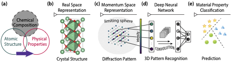



Aloha! I am Raymond Wang, a Research Scientist at ByteDance AI Lab. ...

## My Work And Research
I build quantitative numerical/statistical models to simulate and understand complex chemical and biological systems. 
 
My doctoral research was focused on computational chemistry and cheminformatics, 
where I developed post-Hartree-Fock models to accurately solve the Schrodinger euqation for quantum molecular systems.
computational models to simulate chemical systems and build statistical models (i.e., machine learning models) to predict relevant properties of chemical systems. The research was mainly focused on organic chemical systems as well as inorganic materials domain, with the ultimate goal to accelerate the discovery of novel
chemicals (e.g., drug molecules, photovoltaic materials, electronic materials, etc.)0
My current research focus is on modelling organic molecules (e.g., drug molecules), large biological molecules (e.g., proteins and antibodies), and their interaction mechanisms (fundamental scientific research). The ultimate goal is to accelerate the process of drug discovery. I applied my previous research skills, e.g., computational simulation, statistical modelling, etc., to fulfill my current job duties.

## My Background
I received my Ph.D. in Chemistry from Northwestern University, and B.S. in Physical Chemistry from Fudan University. During my Ph.D. studies, I was mentored by Dr. Toru Shiozaki, Dr. Kenneth Poeppelmeire, and Dr. James Rondinelli.
